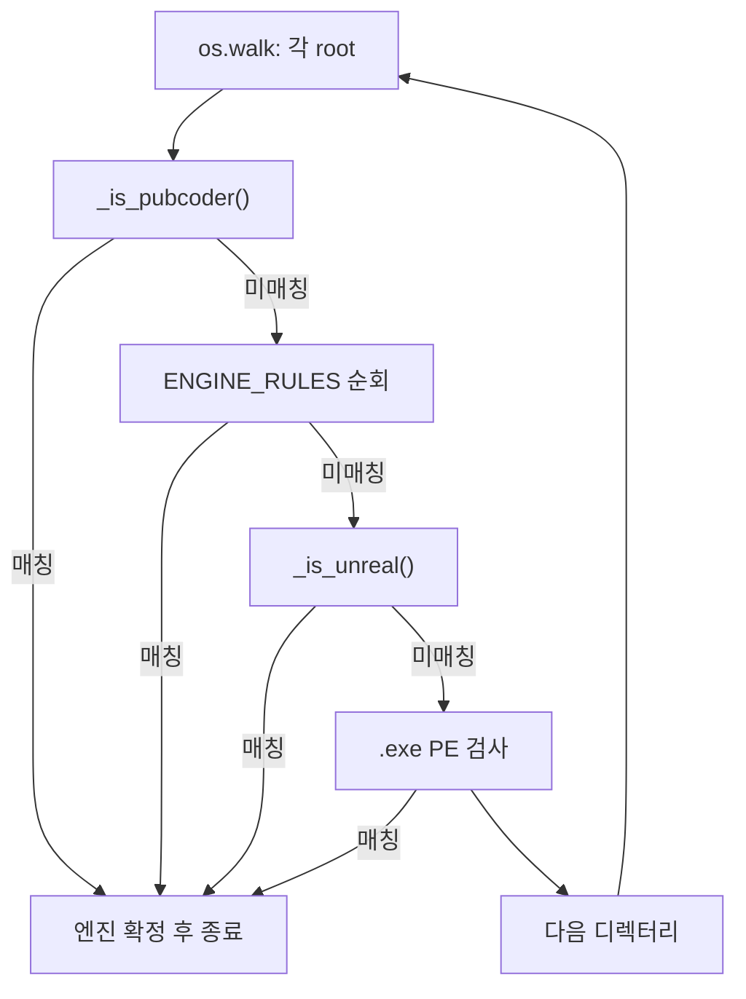

# Troubleshooting: 엔진 식별 오탐 및 스캔 순서 회귀

이 문서는 `src/enginecheck.py`에서 발생했던 **엔진 오탐(False Positive)** 과 **우선순위 역전** 문제의 원인, 해결 과정, 그리고 이후 수정 시 지켜야 할 설계 원칙을 정리합니다.

관련 커밋 흐름:

| 시점 | 상태 |
|------|------|
| `ee707dc` | RPG Maker 검증 추가, `_is_unreal()` + 디렉터리 단위 스캔 (안정) |
| `ee707dc` 이후 | Unreal 규칙을 `ENGINE_RULES`에 통합 + **규칙 우선 전역 스캔**으로 변경 (회귀) |
| 현재 | 본 문서의 해결안 반영 |

---

## 1. 증상 (Symptoms)

### 1.1 RPG Maker / NW.js 게임이 Unreal로 오탐

- NW.js 기반 RPG Maker(MV/MZ)는 `paks/` 폴더와 `nw_100_percent.pak`, `chrome_100_percent.pak` 같은 **Chromium webview 패키지**를 사용합니다.
- Unreal Engine 역시 `Paks/` 디렉터리와 `.pak` 파일을 사용합니다.
- 잘못된 로직에서는 **`paks` 디렉터리 존재만으로** Unreal Engine으로 판정하는 경우가 있었습니다.

**재현 예 (오탐):**

```
game_root/
  paks/
    nw_100_percent.pak    ← webview 전용, Unreal 아님
```

기대: 식별 실패 또는 RPG Maker / NW.js  
실제(버그): `Unreal Engine`

### 1.1.1 Outerplane Cosplay Photobook — PubCoder / NW.js / Unreal 연쇄 오탐 (2026-05-22)

STOVE 경로 `Outerplane_Cosplay_Photobook`은 **PubCoder**로 제작된 인터랙티브 앱이며, 내부 런타임으로 NW.js(`nw.dll`, `nw_*_percent.pak`)를 사용합니다. **Unreal·RPG Maker 모두 아님.**

```
18075/
  nw.dll
  nw_100_percent.pak
  nw_200_percent.pak
  resources.pak
  Outerplane_Cosplay_Photobook.exe   ← 바이너리 내 "pubcoder", ".pubcoder" 문자열
  (파일명에 pubcoder 없음, package.json·.rpgmvp 없음)
```

| 단계 | 잘못된 결과 | 원인 |
|------|-------------|------|
| 1차 | Unreal Engine | `nw_200_percent.pak`이 webview 목록 밖 → `_is_unreal()` |
| 2차 | RPG Maker (MV/MZ / NW.js) | `nw.dll`만으로 RPG Maker 규칙 매칭 (PubCoder보다 우선) |
| **정답** | **PubCoder (Interactive Ebook/App)** | exe 내 `pubcoder` 문자열 + NW.js 런타임 |

**해결 요약:**

- `nw.dll` 단독 조건을 RPG Maker에서 제거 (`package.json` + `nw.dll` 또는 `.rpgmvp`만)
- PubCoder를 `ENGINE_RULES`보다 **먼저** `_is_pubcoder()`로 검사
- 파일명 외 **메인 exe 바이너리**에서 `pubcoder` / `pubreader` 문자열 검색

### 1.1.2 Dreamlike Love with Seira — Electron `locales/*.pak` 오탐 (2026-05-22)

STOVE 런처형 Electron 앱은 루트에 `chrome_*_percent.pak`, `resources/app.asar`가 있고, `locales/ko.pak` 등 **Chromium 언어 팩**을 둡니다. UE `.pak`과 확장자가 같아 `locales` 하위에서 Unreal로 오탐되었습니다.

| 항목 | 내용 |
|------|------|
| 기대 | `Electron (Chromium App)` |
| 버그 | `Unreal Engine` (`locales/en-us.pak` 등 일반 `.pak` 규칙) |
| 해결 | `_is_electron()` 선검사 + `_is_chromium_locale_pak()` 제외 + `locales` 디렉터리 스킵 |

### 1.1.3 Cats Hidden in Italy — Clickteam Fusion `Modules/` 미식별

Clickteam Fusion 빌드는 `Modules/mmf2d3d8.dll`, `kcmouse.mfx` 등을 쓰지만, 루트가 아닌 **하위 `Modules` 폴더**에 있습니다.

| 항목 | 내용 |
|------|------|
| 버그 | `'mmf2' in f`가 파일명 **목록에 `'mmf2'` 항목이 있는지**만 검사 → `mmf2d3d8.dll` 미매칭 |
| 해결 | `any('mmf2' in x for x in f)` 및 `.mfx` / `mmf*` 확장자 규칙 |

### 1.2 PubCoder·RPG Maker가 Unreal보다 늦게 검사됨

- PubCoder, RPG Maker는 파일/경로 패턴이 Unreal과 겹칠 수 있습니다 (`*.pak`, `paks/` 등).
- Unreal 규칙이 `ENGINE_RULES` 상단(3번째)에 있고 **전체 트리를 먼저** 훑으면, 다른 엔진 규칙보다 Unreal이 먼저 매칭될 수 있습니다.

### 1.3 Unity PE 검사 실패

`verify_via_pe()`에서 import DLL 목록을 이미 `str`로 디코딩한 뒤, `bytes`와 비교하는 코드가 있어 Unity PE 기반 검출이 동작하지 않았습니다.

```python
# 버그 예시
imports = [entry.dll.decode().lower() for entry in pe.DIRECTORY_ENTRY_IMPORT]
if b'unityplayer.dll' in [i.encode() for i in imports]:  # 항상 False에 가까움
```

---

## 2. 근본 원인 (Root Causes)

### 2.1 스캔 순서 변경 — “규칙 우선 × 전체 트리”

**안정 버전 (`ee707dc`):**

```
각 디렉터리(root)마다:
  1) ENGINE_RULES 전체 (우선순위 순)
  2) _is_unreal()  ← Unreal은 규칙 통과 후에만
  3) PE 검사 (.exe)
```

**회귀 버전:**

```
각 ENGINE_RULES 규칙마다:
  전체 os.walk 트리를 처음부터 끝까지 스캔
→ 규칙 3번(Unreal)이 트리 어디서든 먼저 걸리면, 규칙 20번(Unity)은 검사 기회 없음
```

같은 설치 폴더 안에서 **하위 경로에 Unreal 흔적**이 있고 **루트에 Unity**가 있는 경우, 디렉터리 단위 스캔은 “현재 폴더에서 먼저 맞는 규칙”을 고르지만, 규칙 우선 전역 스캔은 **낮은 인덱스 규칙이 전체를 독점**합니다.

### 2.2 `_is_unreal()` 제거 및 단순화된 Unreal 규칙

`_is_unreal()`에는 다음 **오탐 방지 자산**이 들어 있었습니다.

| 로직 | 목적 |
|------|------|
| `pubcoder` / `pubreader` 파일명 제외 | PubCoder 오탐 방지 |
| `.rpgmvp` 제외 | RPG Maker MV/MZ |
| `package.json` + `nw.dll` 제외 | NW.js 런타임 |
| `webview_paks` 화이트리스트 제외 | NW.js/Chromium 내장 pak |
| `cef` / `node` / `nw` 경로 제외 | NW.js/Chromium 관련 경로 |

회귀 버전은 `ENGINE_RULES` 안에 좁은 Unreal 패턴만 두었고(`Binaries`+`Engine`, `win64-shipping`), **`paks/` + 일반 `.pak` 기반 fallback**과 webview pak 필터가 사라졌습니다.

### 2.3 `paks` 디렉터리만으로 Unreal 판정

과거 `_is_unreal()` 일부 로직:

```python
if 'paks' in dirs and not any(x in root.lower() for x in ['cef', 'node', 'nw']):
    return True  # ← 이 디렉터리에 .pak 파일이 없어도 True
```

부모 디렉터리에 `paks/` 하위 폴더만 있고, 실제 webview pak은 **자식 폴더**에 있는 경우 부모에서 Unreal로 조기 종료됩니다.  
RPG Maker는 루트에 `package.json` + `nw.dll`이 있으면 `ENGINE_RULES`에서 먼저 걸러지지만, **해당 파일이 없는 경로**에서는 여전히 오탐이 납니다.

---

## 3. 해결 과정 (Resolution)

### 3.1 스캔 루프 복원

`scan_files()`를 **디렉터리 단위 3단계**로 되돌렸습니다.



핵심: **Unreal은 `ENGINE_RULES` 밖**, 같은 `root`에서 다른 규칙이 모두 실패한 뒤에만 후보가 됩니다.

### 3.2 `_is_unreal()` 복원 및 보강

`ENGINE_RULES`에서 Unreal 항목을 **제거**하고, `_is_unreal()`만 Unreal 후보로 사용합니다.

**제외 조건 (오탐 방지):**

- `pubcoder` / `pubreader` in 파일명
- `.rpgmvp` 확장자
- 동일 디렉터리에 `package.json` + `nw.dll` (NW.js)

**포함 조건 (Unreal 후보):**

| 조건 | 설명 |
|------|------|
| `binaries` + `engine` in dirs | 전형적인 UE 빌드 출력 구조 |
| `win64-shipping` in 파일명 | Shipping 빌드 실행 파일 |
| `.ucas` / `.utoc` | UE5 IoStore |
| `.pak` (webview 목록 제외) | 게임 에셋 pak; NW webview pak 제외 |

**webview pak 화이트리스트** (NW.js/Chromium — 변경 시 회귀 주의):

```
resources.pak
chrome_100_percent.pak
nw_100_percent.pak
chrome_200_percent.pak
nw_200_percent.pak
```

추가로 `nw_*.pak` 접두 패턴 전체를 webview로 간주합니다.

**PubCoder vs RPG Maker (NW.js):** 둘 다 `nw.dll`을 쓰므로 `nw.dll`만으로 RPG Maker 판정하면 안 됩니다. PubCoder는 디렉터리마다 `_is_pubcoder()`로 **선검사**하며, `package.json`·`.rpgmvp`가 없고 exe에 `pubcoder` 문자열이 있으면 PubCoder로 확정합니다.

**제거한 로직:** `paks` 디렉터리 **이름만**으로 Unreal 판정 — 반드시 위 “포함 조건” 중 하나와 함께 사용합니다.

### 3.3 PE 검사 수정

```python
if 'unityplayer.dll' in imports:
```

문자열 비교로 통일하여 `Unity Engine (Detected via PE)` 경로가 다시 동작합니다.

---

## 4. 검증 방법

### 4.1 단위 테스트

```bash
cd src
python -m unittest test_engine -v
```

주요 시나리오 (`test_engine.py`):

| 테스트 | 기대 엔진 |
|--------|-----------|
| `game.ini` | RPG Maker (XP/VX/VX Ace) |
| `*.rpgmvp` | RPG Maker (MV/MZ / NW.js) |
| `package.json` + `nw.dll` | RPG Maker (MV/MZ / NW.js) |
| 위 + `paks/nw_100_percent.pak` | RPG Maker (MV/MZ / NW.js) |
| `nw.dll` + paks + exe 내 `pubcoder` | PubCoder (Interactive Ebook/App) |
| `paks/nw_100_percent.pak` 만 | 식별 실패 (Unreal 아님) |
| `paks/foo.pak` | Unreal Engine |
| `Binaries` + `Engine` | Unreal Engine |
| `*_data` / `unityplayer.dll` | Unity Engine |

### 4.2 실제 게임 경로 스팟 체크 (예시)

| 경로 (예) | 기대 |
|-----------|------|
| Company of Heroes 3 | Essence Engine 5.0 (Relic) |
| Peglin | Unity Engine |
| Outerplane Cosplay Photobook | PubCoder (NW.js 런타임, exe 내 `pubcoder` 문자열) |

---

## 5. 설계 원칙 — 이후 수정 시 체크리스트

새 엔진 규칙을 추가하거나 스캔 방식을 바꿀 때 아래를 확인하세요.

1. **PubCoder는 `ENGINE_RULES`보다 먼저 (`_is_pubcoder`)**  
   - NW.js 런타임을 공유하므로 `nw.dll`만으로 RPG Maker 판정 금지.  
   - 파일명에 `pubcoder`가 없으면 **exe 바이너리 문자열**까지 검사합니다.

2. **`ENGINE_RULES` 순서 = 우선순위**  
   - RPG Maker, PubCoder처럼 `.pak` / `paks`와 겹치는 엔진은 **Unreal보다 위**에 둡니다.

3. **Unreal은 `_is_unreal()` 단일 진입점**  
   - `ENGINE_RULES`에 Unreal을 다시 넣지 않습니다.  
   - NW.js webview pak 화이트리스트를 우회하는捷徑을 만들지 않습니다.

4. **스캔은 디렉터리 단위 3단계 유지** (`PubCoder 선검사` → 규칙 → `_is_unreal` → PE)  
   - `규칙 → _is_unreal → PE` 순서를 바꾸거나, “규칙마다 전체 트리” 패턴으로 되돌리지 않습니다.

5. **`.pak`만으로 판정하지 않기**  
   - `paks/` 폴더 이름, 단일 webview pak만으로 Unreal 확정 금지.

6. **회귀 테스트 실행**  
   - `python -m unittest test_engine -v`  
   - RPG Maker / PubCoder / NW.js 샘플 경로 수동 1회 확인

---

## 6. 참고: 현재 코드 위치

| 항목 | 파일 | 설명 |
|------|------|------|
| 규칙 목록 | `src/enginecheck.py` → `ENGINE_RULES` | 엔진별 패턴·deps |
| PubCoder 선검사 | `src/enginecheck.py` → `_is_pubcoder()` | NW.js + exe 바이너리 문자열 |
| 오탐 방지 | `src/enginecheck.py` → `_is_unreal()` | Unreal 전용 후처리 |
| 스캔 진입 | `src/enginecheck.py` → `scan_files()` | PubCoder → 규칙 → Unreal → PE |
| PE fallback | `src/enginecheck.py` → `verify_via_pe()` | Unity import 검사 |
| 회귀 테스트 | `src/test_engine.py` | tempfile 기반 unittest |

---

## 7. 관련 이슈가 다시 보일 때

| 현상 | 먼저 확인할 것 |
|------|----------------|
| RPG Maker가 Unreal로 나옴 | 루트에 `package.json`+`nw.dll` 또는 `.rpgmvp` 규칙 매칭 여부; `_is_unreal` 제외 조건 |
| Unity 게임이 Unreal로 나옴 | 스캔이 “규칙별 전체 트리”로 바뀌지 않았는지; `_is_unreal`이 `ENGINE_RULES`보다 먼저 전역 실행되지 않는지 |
| Unreal 게임이 Unknown | `binaries`/`engine`, `.ucas`, non-webview `.pak` 조건; 경로 대소문자(lower 처리) |
| Unity PE 미검출 | `verify_via_pe` import 비교가 `str`인지 |

문서 개정 시점: 2026-05-22  
대상 버전: `enginecheck.py` (post-fix, `_is_unreal` + directory-scoped scan)
